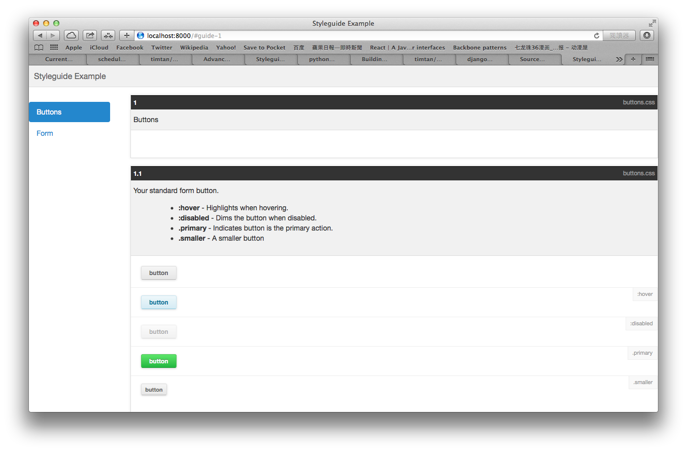

************
introduction
************

help you launch your style guide site with KSS syntax

======
start
======

    pip install django-kss

Project Settings
==========================

Add the two app,

    INSTALLED_APPS = {
        ...
        "django_kss",
        "pykss.contrib.django",
    }

Add setting in your project's settings with the two extra config

* PYKSS_DIRS:  Setup source file path, less sass or css
* PYKSS_STATIC_FILES: the full path in your assets. final page use it to show content

Routing, add the following two lines in your project's urls.py

import:

    import django_kss.urls

add the url patterns:

    url(r'^$', include(django_kss.urls)),

Use the The Preconfigured Django Server
=======================================

    * git clone https://github.com/timtan/django_kss
    * cd django_kss
    * virtualenv venv
    * source venv/bin/activate
    * pip install -r requirements.txt
    * cd django_kss_project
    * python manage.py runserver

Development
============

計畫可以方便的做 Style Guide.

DRY 要到一個極致。

只有寫 CSS, 接下來，就可以自動產生 Style Guide 的頁面。

CSS -> Generate List, Generate Page

所有的　input 由產生的　css 來做判斷，這樣才能跟所有的　CSS Preprocessor 整合。

計畫：

1. 做成　APP, 整進　Django
2. 畫面可以由 Bootsrap 的　tab 來分段較順手跟簡單。
3. 我們需要設定的，是檔案清單位置，還有 CSS 檔位置。
    * 檔案清單在　setting.py
    * CSS 位置都寫在　Settting.py 集中　setting

